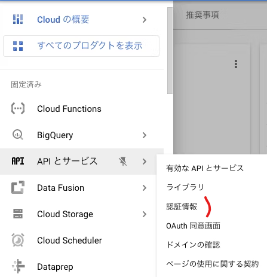
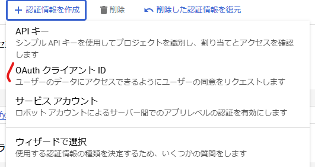
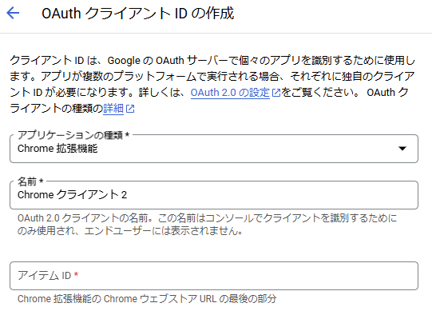
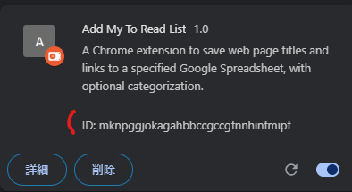
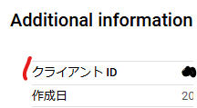
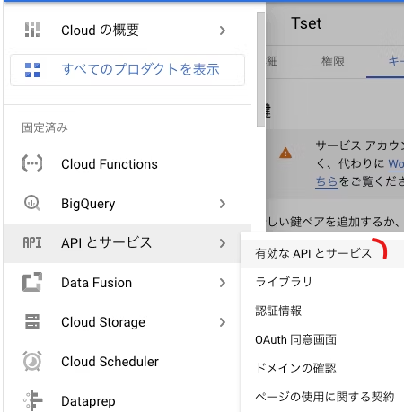
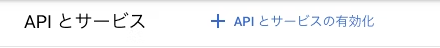

# Add My To Read List

This Chrome extension allows you to easily save the information about the web page you're currently viewing to a Google Spreadsheet.

**Key Features**  
- Automatically captures and records the web page title.
- Saves the web page URL.
- Saves the categorization as optional.  

## How It works  

### Prerequisite   
1. Create GCP Project.  
    This is the [official guide](https://cloud.google.com/resource-manager/docs/creating-managing-projects?hl=ja)  
    You can see the existing projects [here](https://console.cloud.google.com/welcome?hl=ja&project=kurakuda-verify-household-acct)
2. Open 「APIとサービス」＞「認証情報」  
      
3. Create Service Account  
      
      
    - Select `アプリケーションの種類` as `Chrome 拡張機能`  
    - Enter a name to `名前`  
    - Enter ID to `アイテムID`  
    ** You can get アイテムID from `chrome://extensions/` with developer mode.  
     
4. Get Chrome App Application ID  
       
    ** You can make use of this [link](https://developer.chrome.com/docs/extensions/how-to/integrate/oauth?hl=ja#upload_to_dashboard) accordingly.  
5. Enable Google Sheets API  
    1. Open 「APIとサービス」＞「有効なAPIとサービス」  
          
    2. Select 「+ APIとサービスの有効化」  
          
    3. Select Google Sheets API  

### Steps
1. Copy `manifest.sample.json` to `manifest.json` and replace `oauth2.client_id` with your Chrome App Application ID.  
2. Run `npm run build:prod` to build.  
    ** You can use `npm run build:dev` for development mode.  
3. Load Chrome Extension at `chrome://extensions/` .  